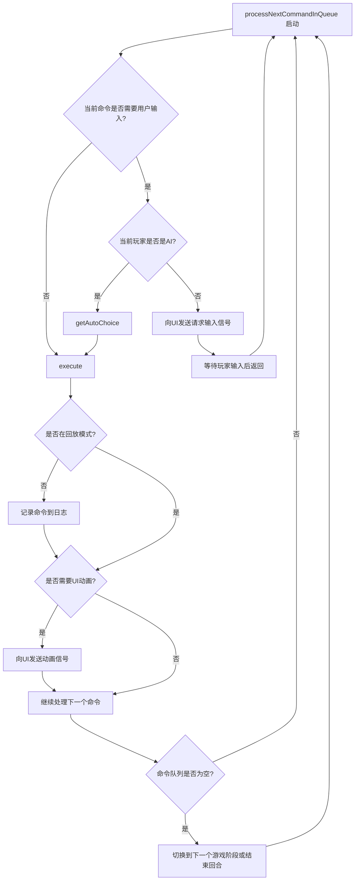

# Machi_Koro_AI

所有主动技能：

| 事件         | 界面效果                                 |
| ------------ | ---------------------------------------- |
| 抛骰子       |                                          |
| 【广播站】   | /                                        |
| 【港口】     | /                                        |
| 【拆迁公司】 | 选择一个自己的地标建筑                   |
| 【商业中心】 | 选择自己的一张卡，选完后选其他人的一张卡 |
| 【搬家公司】 | 选择自己的一张卡，选完后选其他人         |
| 【金枪鱼船】 | /                                        |
| 购买卡       | 选择商店的一张卡                         |
| 【科技公司】 | /                                        |


   


 队列设计原理：



```
Machi_Koro_AI/
├── CMakeLists.txt              # 主 CMake 构建文件
├── main.cpp                    # 应用程序入口点，包含 QApplication 和主窗口创建
├── mainwindow.h                # 主窗口头文件
├── mainwindow.cpp              # 主窗口实现
├── mainwindow.ui               # 主窗口 UI 定义文件
├── Machi_Koro_AI.qrc           # Qt 资源文件 (图片、图标、音效等)
├── Machi_Koro_AI_zh_CN.ts      # 翻译文件 (如果使用 Qt Linguist)
├── src/                        # 核心游戏逻辑和数据模型
│   │
│   ├── gamecontroller.h        # 游戏控制器头文件
│   ├── gamecontroller.cpp      # 游戏控制器实现
│   │
│   ├── gamestate.h             # 游戏状态头文件
│   ├── gamestate.cpp           # 游戏状态实现
│   │
│   ├── player.h                # 玩家类头文件
│   ├── player.cpp              # 玩家类实现
│   │
│   ├── card.h                  # 卡牌基类头文件
│   ├── card.cpp                # 卡牌基类实现
│   │
│   ├── cardfactory.h           # 卡牌工厂头文件
│   ├── cardfactory.cpp         # 卡牌工厂实现
│   │
│   ├── gamecommand.h           # 命令基类头文件
│   ├── gamecommand.cpp         # 命令基类实现
│   │
│   ├── commandfactory.h        # 命令工厂头文件
│   ├── commandfactory.cpp      # 命令工厂实现
│   │
│   ├── dice.h                  # 骰子类头文件 (如果需要独立类)
│   ├── dice.cpp                # 骰子类实现
│   │
│   ├── randomutils.h           # 随机数工具类头文件
│   │
│   ├── ai/                     # AI 相关的逻辑
│   │   ├── aibase.h            # AI 基类 (如果需要多种AI策略)
│   │   ├── aibase.cpp
│   │   ├── simpleai.h          # 简单 AI 实现
│   │   └── simpleai.cpp
│   │
│   ├── cards/                  # 所有卡牌的定义 (按颜色或类型分类)
│   │   ├── card_includes.h     # 方便 CMake GLOB_RECURSE 包含所有卡牌 (可选)
│   │   │                       # 或者用于 #include 所有卡牌头文件进行注册
│   │   │
│   │   ├── blue/               # 蓝色卡牌
│   │   │   ├── wheatfieldcard.h
│   │   │   └── wheatfieldcard.cpp
│   │   │   ├── ranchcard.h
│   │   │   └── ranchcard.cpp
│   │   │   └── ...
│   │   │
│   │   ├── red/                # 红色卡牌
│   │   │   ├── cafecard.h
│   │   │   └── cafecard.cpp
│   │   │   └── ...
│   │   │
│   │   ├── green/              # 绿色卡牌
│   │   │   ├── bakerycard.h
│   │   │   └── bakerycard.cpp
│   │   │   └── ...
│   │   │
│   │   ├── purple/             # 紫色卡牌
│   │   │   ├── tvstationcard.h
│   │   │   └── tvstationcard.cpp
│   │   │   ├── stadiumcard.h
│   │   │   └── stadiumcard.cpp
│   │   │   └── ...
│   │   │
│   │   └── landmark/           # 地标卡牌
│   │       ├── trainstationcard.h
│   │       └── trainstationcard.cpp
│   │       └── ...
│   │
│   └── commands/               # 所有命令的定义 (按类型或功能分类)
│       ├── command_includes.h  # 方便 CMake GLOB_RECURSE 包含所有命令 (可选)
│       │                       # 或者用于 #include 所有命令头文件进行注册
│       │
│       ├── dicerollcommand.h
│       ├── dicerollcommand.cpp
│       │
│       ├── purchasecardcommand.h
│       ├── purchasecardcommand.cpp
│       │
│       ├── gaincoinsfrombankeffect.h
│       ├── gaincoinsfrombankeffect.cpp
│       │
│       ├── tvstationeffectcommand.h
│       ├── tvstationeffectcommand.cpp
│       │
│       └── ... (其他具体命令)
│
└── resources/
```

