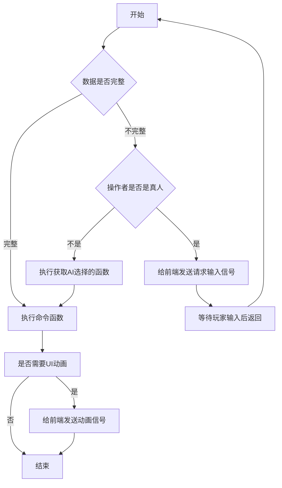
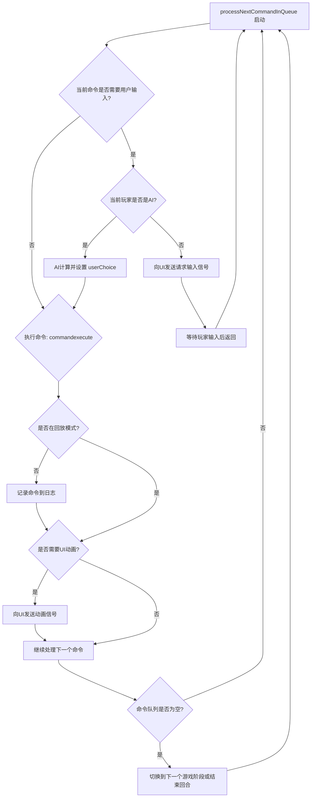

# Machi_Koro_AI

```mermaid
flowchart TD
    A[开始] --> B{数据是否完整}
    B -->|不完整| C1{操作者是否是真人}
    B -->|完整| C2[执行命令函数]
    C1 -->|不是|D1[执行获取AI选择的函数]
    D1 -->C2
    C1 -->|是|D2[给前端发送请求输入信号]
    D2-->E[等待玩家输入后返回]
    E-->A
    C2-->F[是否需要UI动画]
    F-->|是|G1[给前端发送动画信号]
    F-->|否|G2[结束]
    G1-->G2
    
    
    
    
```

```mermaid
flowchart TD
    A[processNextCommandInQueue 启动] --> B{当前命令是否需要用户输入?}
    B -- 是 --> C{当前玩家是否是AI?}
    B -- 否 --> G{执行命令: commandexecute}

    C -- 是 --> D[AI计算并设置 userChoice]
    D --> G

    C -- 否 --> E[向UI发送请求输入信号]
    E --> F[等待玩家输入后返回]
    F --> A

    G --> H{是否在回放模式?}
    H -- 否 --> I[记录命令到日志]
    I --> J{是否需要UI动画?}
    H -- 是 --> J

    J -- 是 --> K[向UI发送动画信号]
    K --> L[继续处理下一个命令]
    J -- 否 --> L

    L --> M{命令队列是否为空?}
    M -- 否 --> A
    M -- 是 --> N[切换到下一个游戏阶段或结束回合]
    N --> A
```

