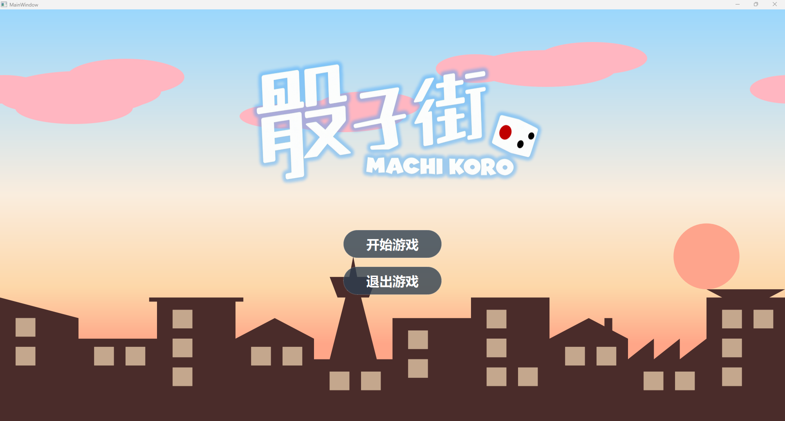
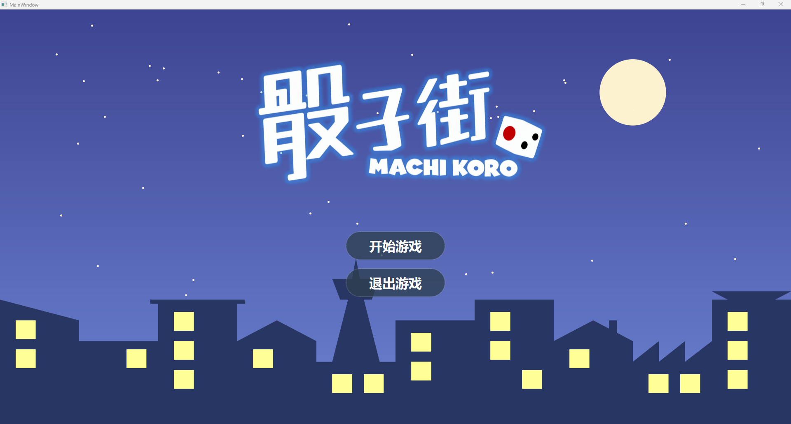
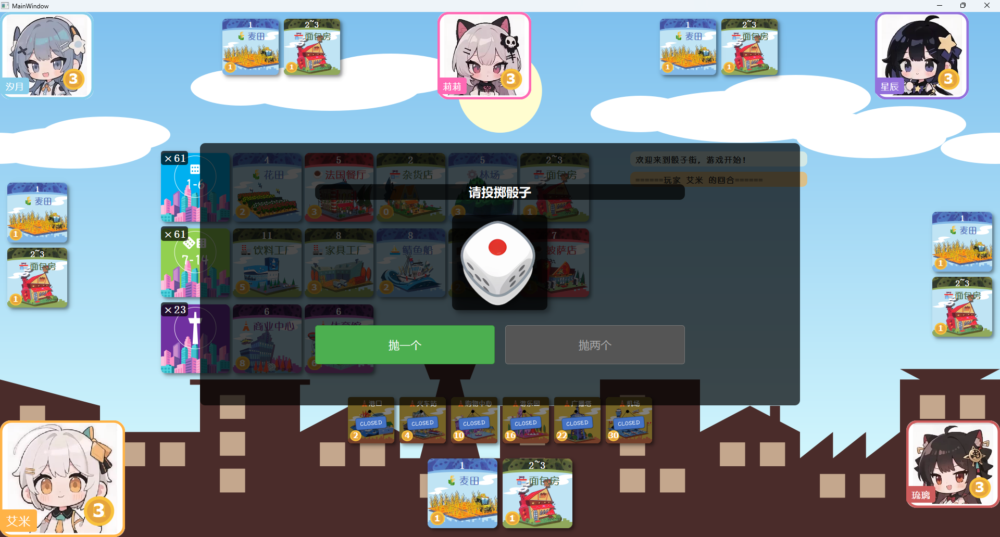
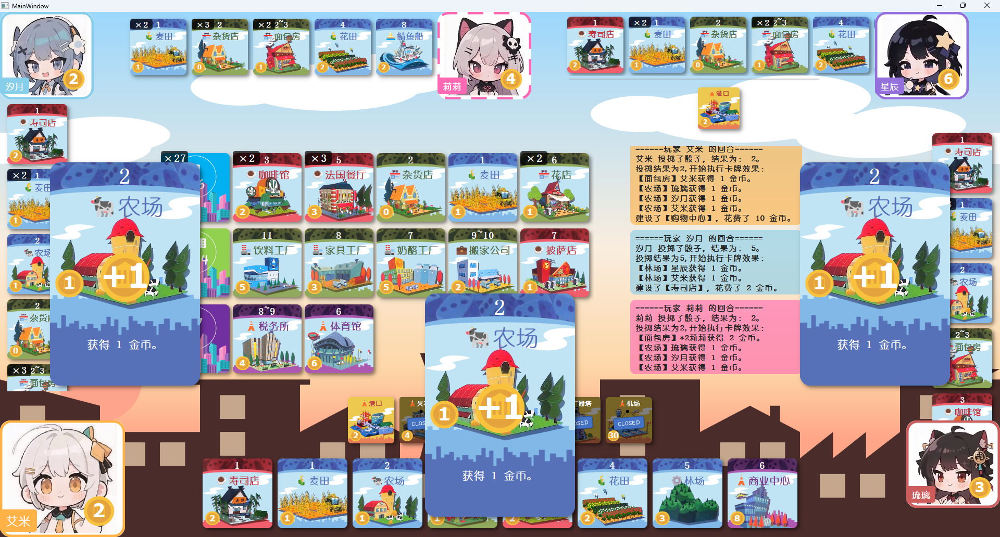
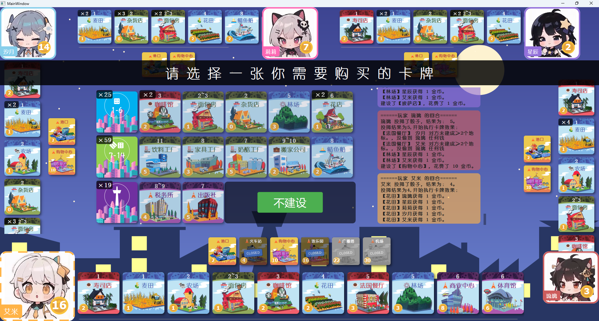

# Machi Koro AI

这是一个基于 Qt 的《Machi Koro（骰子街）》桌游电子化项目，包含完整的游戏流程、动画与 AI 对战。

## 制作动机

- 线下骰子街找不到人玩
- 正版Steam骰子街太贵了
- 骰子街卡牌逻辑简单适合做游戏
- Java转C++的Qt初学者
- Unity没学过者（作者我这辈子都不会再用Qt写游戏）

## 实机画面

### 启动界面

如果用图片清晰度很差且无法做到动效，视频动效多但会很卡，所以直接用qt手绘背景图，配色参考AI。

支持四种天气变化，后续（如果有时间，现在疲于找实习QAQ）打算增加设置和读档选项，设置包括控制音量大小、游戏初始卡牌修改/金币修改等功能。

### 游戏界面

骰子街游戏版本：2016版552分堆（作者认为平衡性最强的一个版本）

新手教程已经没有时间写了，能查到我这个项目的就默认会玩了，不会玩的放个视频链接：[【桌游随便玩02】《骰子街》—拼运气、轻策、卡牌构筑、推新利器_哔哩哔哩_bilibili](https://www.bilibili.com/video/BV1BZ4y1K7VE/?spm_id_from=333.337.search-card.all.click&vd_source=6d58f9d1e033f108043d07da57ce4bca)

目前是只支持玩家和4个人机玩，人机我是用的**基于理性人假设的动态期望计算**加上一些特殊卡牌的特判来写的，如何计算[开发文档.md](开发文档.md)有建模公式，自我感觉写的好（因为**我自己玩了5把才打赢过一次人机**）！

很多UI感觉还没设计好，比如选项位置和颜色，有时间我再改改吧，自适应做的我非常头疼，不调库从头开始非常难受。

### 动画设计

- 卡牌移动是要有动画的
- 金币变化是要有动画的
- 天气切换是要有动画的
- 人物头像是要有动画的
- 动画太多是会卡顿的

角色是mp4格式非常卡，其实用gif更好，但是画质很差，所以被迫只让当前回合玩家动了，所以我觉得当时用Qt写游戏就很傻X。

你问我人物动画怎么做的？当然是先AI生图后AI图生视频了，我美术功底要有这么好我就不当码农了。

### 碎碎念

- 做下来的感觉最难部分还是设计，比如五个角色怎么排布，商店位置在哪，日志位置在哪，普通卡牌和地标卡牌放哪，各种弹窗又在哪，设计好了发现代码是最简单的。
- 直接扫描得来的图很模糊，所以对于每张卡牌除了房子是抠的，底色都是用PPT高仿原作的，执着画质这一块，包括像1~6的卡片背面图，也是用PPT画的。
- 后端最难的还是卡牌效果执行先后顺序了，比如【麦田】收益类资源直接金币++，【果蔬超市】要计算combo的量我也忍了，那【搬家公司】直接吓哭了：先要找出可以选择的卡牌，【搬家公司】又得透明以遍玩家选择，玩家不能连续选择两个【麦田】因为前端只显示最顶上的所以不能同时执行所有【搬家公司】，就光前端能设计很久。
- AI数学建模也是想了很久，因为总是算期望而真人算不过来导致真人总是很难获胜，纯随机买比如没有农田一直买【果蔬超市】也很傻x，所以我设置了个**阶梯式衰减概率选择**，AI买卡有小概率会”不那么聪明”来增加玩家体验，如果你想挑战困难模式可以在代码直接设置买最优的。
- 本来后续还想出选择角色，不同角色不同技能，比如汐月定位“研究员”，效果是“你初始获得一张【玉米田】（限定卡），比如艾米定位是精灵，效果是“你不会太倒霉"，后台设计当排名最后时抛出最大收益概率大幅增加，这类的，但现在已经燃尽了。

### 作者寄语

此项目仅供Qt初学者参考，Qt真不适合写游戏，就当作者我作为反面教材吧。

## 运行环境

- Windows 10/11
- Qt 6.9 或更高
- CMake 3.20 或更高
- MinGW 64-bit（与 Qt 套件匹配）

## 构建与运行

1. 使用 Qt Creator 打开根目录下的 CMakeLists.txt
2. 选择与 Qt 版本匹配的 MinGW 64-bit 套件
3. 生成并构建项目
4. 运行生成的可执行文件

若需要命令行构建，可在 Qt Creator 配置完成后使用 CMake 预设或 Ninja 构建系统。

## 项目结构

- 核心逻辑位于 src/ 目录
- 资源文件位于 resources/ 目录
- UI 相关位于 src/ui/ 目录
- 详细说明见 [开发文档.md](开发文档.md)

## 本地化

中文翻译资源位于 [Machi_Koro_AI_zh_CN.ts](Machi_Koro_AI_zh_CN.ts)，打包后的 qm 文件会输出到 QM_FILES_OUTPUT_DIR。

## 许可

如需发行或商用，请先确认相关素材与规则文本的授权情况。