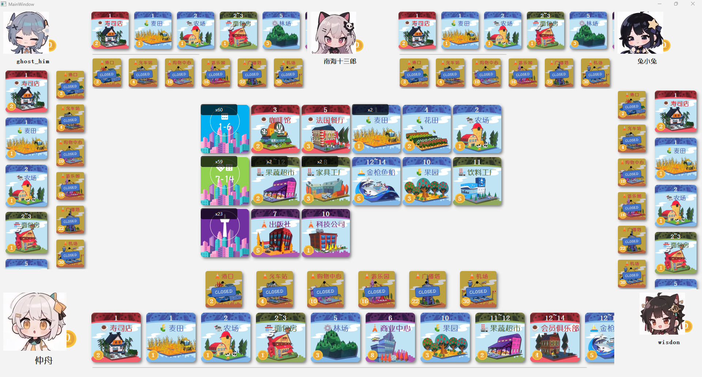

# Machi Koro Qt (骰子街 Qt 版) 🎲

gitcode仓库地址：https://gitcode.com/qq_51602939/Machi_Koro_AI

## 简介

本项目是基于 C++ 和 Qt 框架实现的桌面版《骰子街》(Machi Koro) 游戏，但你如果能看到这里，说明你的成分是：

- 会玩骰子街但正版太贵了
- 不会玩骰子街但想用Qt写游戏
- 通过各种机器人转发在各种平台的项目点进来了


这个是我希望做的图啦，但是我现在做成的是这样：




项目还未完工，后端已经大体完成，现在在苦恼做前端UI动画。。。

但先别走！你可以先关注我，以后就是老粉啦~

## 进度列表

- [x] ### 需求分析 6.1~6.4

  “做一款属于自己的游戏一直是我的梦想。”

  “我特别喜欢玩骰子街，线下没人和我玩，线上Steam卖太贵了。”

  “Qt怎么没什么人用来写游戏啊！”

  基于以上三点，所以就有了我尝试用Qt写一个骰子街的想法。。。

- [x] ### 可行性分析 6.4~6.7

  做一个游戏前，最重要的就是得考虑游戏逻辑实现难度、AI决策实现难度以及UI及动画实现难度。

  #### 游戏逻辑实现难度

  游戏逻辑实现难度无非就三种操作、抛骰子操作、卡牌运作、买卡操作，其中卡牌运作大多是金币增加和金币减少，偶尔有少量换卡的操作，最难点在于卡牌的执行顺序，也就是说卡牌运作方式顺序不同，但是基础操作相同，为了不写死顺序，使得程序有扩展性，可以运用命令模式实现，即将各种操作转化为命令，放入命令队列里顺序执行。

  #### AI决策实现难度

  做单机游戏肯定要有AI决策的，这款美式桌游优点就是随机性大于决策性，在AI方面不需要复杂设计，甚至就random选择运气好人机都能赢，难一点就设计成一直买贵的卡（怕别人偷），再难点设计无非就是算买各种卡的下一轮收益期望（目标实现），遇到算期望的事AI比真人就好用多了。

  不只买卡，其他操作比如选则扔一个还是两个、是否重抛，还是+2啥的，都可以算期望实现利益最大化，也是非常简单的算法。

  #### UI及动画实现难度

  UI已经有现成的UI了，扫描后再扣下来能省非常多的事，剩下的图随便找几个生图软件生成就行，不在美工上花太多功夫（虽然我也学了2年美术）。

  动画是最难的了，因为之前没学过Qt，不知道如何做动画，但没关系，走一步算一步吧，动画有无都行，只影响观感不影响游戏体验🤭。

  

  鉴于AI、UI都很容易设计，决心将这款游戏做大做强，完成我想做一款游戏的心愿（以后上班估计没这么闲了）

  

- [x] ### MVC架构设计 6.8~6.15

  由于项目需要管理比较多的东西，所以后端需要有关能储存这些东西的类（Model），取名为GameState，记录游戏当前状态，然后控制中心（Controller）用来控制GameState和UI（View），做成整体架构。

  模型层GameState拥有Player、CardStore，而Player、CardStore拥有GameState创造的Card。Card又有各种种类，很多种类作用相同（比如【花田】、【麦田】等众多蓝卡都是获得钱，而某些特殊卡牌（比如科技公司）有多个操作，所以把他操作抽象成一个个Command，实现高度解耦。

  MVC架构不得不说挺有用的，能更好的将前端显示、后端数据存储以及后端处理逻辑分开来。

  ```mermaid
  classDiagram
     Card<|-- 麦田
     Card<|-- 面包店
     Card<|--科技公司
     Command<|--游戏开始
     Command<|--掷骰子
     Command<|--赚钱
     Command<|--偷所有人钱
     Command<|--投资
     掷骰子 <.. 游戏开始:create
     赚钱 <.. 麦田:create
     赚钱 <.. 面包店:create
     偷所有人钱 <.. 科技公司:create
     投资 <.. 科技公司:create
     Card o-- Player
     Card o-- CardStore
     Player *-- GameState
     CardStore *-- GameState
     Card *-- GameState
     Command *-- GameController
     Dice *-- GameState
     GameState <--GameController
     UI <--GameController
  ```

  

- [x] ### 命令模式设计 6.16~6.22 （待完善）

  由于前面提到卡牌有很多不同的顺序，所以得设计命令模式，当某张卡被激活时，应该生成一个或多个命令，生成在controller的命令队列中，等待被处理。处理机制应该有controller，流程图为：

  ```mermaid
  flowchart TD
      A[processNextCommandInQueue启动] --> B{当前命令是否需要用户输入}
      B --> C{当前玩家是否是AI}
      B --> G{执行命令 commandexecute}
  
      C --> D[AI计算并设置 userChoice]
      D --> G
  
      C --> E[向UI发送请求输入信号]
      E --> F[等待玩家输入后返回]
      F --> A
  
      G --> H{是否在回放模式}
      H --> I[记录命令到日志]
      I --> J{是否需要UI动画}
      H --> J
  
      J --> K[向UI发送动画信号]
      K --> L[继续处理下一个命令]
      J --> L
  
      L --> M{命令队列是否为空}
      M --> A
      M --> N[切换到下一个游戏阶段或结束回合]
      N --> A
  ```

  由于还需要前端交互，目前只做了初步构想，所以待完善。

- [x] ### 命令顺序设计 6.16~6.19

  根据游戏基本顺序、卡牌执行顺序（先红再蓝绿再紫）、同红色优先执行离投掷者最近玩家、同颜色卡执行顺序（先扣钱（如借贷公司）、再获得钱、再combo，最后特殊技能（如拆迁公司、搬家公司）等，设计的命令顺序如下：

  ```mermaid
  kanban
    游戏启动与基础行动
      [空命令]
      [初始化游戏]
      [游戏开始]
      
    抛骰子阶段
       [抛骰子]
       [【广播塔】]
       [【港口】]
    
    
    卡牌效果 - 红卡
    	 [偷钱
     【寿司店】
     【咖啡馆】
     【法国餐厅】
     【披萨店】
     【西餐厅】
     【会员俱乐部】]
  
    卡牌效果 - 蓝卡/绿卡
      [赚钱
     【麦田】【农场】【花田】【林场】【鲭鱼船】【果园】【杂货店】【面包房】]
      [特殊赚钱
     【金枪鱼船】]
      [组合名称赚钱
     【花店】]
      [组合类型赚钱
     【奶酪工厂】
     【家具工厂】
     【果蔬超市】
     【饮料工厂】]
      [【拆迁公司】]
      [【搬家公司】]
      
  
    卡牌效果 - 紫卡
      [偷所有人的钱
      【体育馆】
      【科技中心】]
      [【税务所】]
      [【出版社】]
      [【商业中心】]
  
    建设阶段
      [【市政厅】]
      [建设]
      [判断是否游戏结束]
      [【机场】]
      [【科技公司】显示是否投资1元]
      [【游乐园】]
  ```

  因为有些命令不是通过卡产生，比如抛骰子、买卡的这种没回合都得操作，所以当新的玩家开始游戏时，得固定放上某些操作，不如封装成一个命令，用以生成某些命令。

  按照这个规则，能将所有操作都转化成命令，则设计的命令创建顺序为：

  ```mermaid
  flowchart TD
      A[回合开始] --> B[抛骰子阶段]
      A --> C[激活地标阶段]
      A --> E[激活卡阶段]
      A --> F[建造阶段]
  
      C --> G[港口]
      C --> H[游乐园]
      C --> D[其他地标...]
    
      E --> J[麦田]
      E --> K[面包房]
      E --> L[其他卡...]
  
  
  ```

  但问题来了，我希望在设计UI时：如果是卡牌的命令，在即将执行的时候保持”闪烁“状态，那么就得设计某张卡牌什么时候该亮，什么时候该暗。比如我抛骰子动画之前，港口是不闪烁的（因为你此时不知道你抛的是什么），但是你抛到了10以上，在选择是否+2的时候，港口闪烁，而你如果抛到10以下，港口一直不闪烁。

  所以有两种方案，要不设计一个由命令发出的信号提示卡牌闪烁和取消闪烁状态，要不直接设计二级命令产生三级命令对象，队列中存在某个卡牌命令就直接保持闪烁。前者好处是创建和闪烁职责分离使得代码好理解，后者好处是不用考虑闪烁问题代码简单除暴。我选择后者，因为你会发现，你让一个卡闪烁/取消闪烁，正是创建/取消了他的命令，也就是说闪烁和命令是强绑定的，于是就有了下面的命令创建顺序：

  ```mermaid
  flowchart TD
      A[回合开始] --> B[抛骰子阶段]
      A --> |有广播塔| C[广播塔]
      A --> D[激活卡阶段]
      A --> E[市政府]
      A --> F[建造阶段]
  
      B --> |有港口且骰子>=10| G[港口]
  
      C --> |有港口且骰子>=10| G
      C -.-> |有港口且骰子<10| G
  
      D --> |有游乐园| H[游乐园]
      D --> I[获得金币等卡牌命令...]
  
      E --> J[机场]
  
      F --> |有科技公司| K[科技公司]
      F -.-> |买了东西| J
  ```

  其中，实线为创建，虚线为删除，虽然理解起来很复杂，但是这大大简化了代码量。

- [x] ### 工厂模式设计 6.20~6.21

  工厂模式就类似方法和类名映射了，这种将文件树发给AI就能生成工厂，不必花费太多精力。

  ```mermaid
  classDiagram
      direction LR
  
      class Card {
          <<abstract>>
          // 抽象卡牌基类，定义所有卡牌的通用接口
           +QString name()
           +int cost()
           +CardColor color()
           +QList<int> activationDiceRolls()
          
      }
  
      class AppleOrchard {
          // 具体蓝色卡牌示例
          +AppleOrchard(QObject* parent = nullptr)
      }
      class Bakery {
          // 具体绿色卡牌示例
          +Bakery(QObject* parent = nullptr)
      }
      class Airport {
          // 具体地标卡牌示例
          +Airport(QObject* parent = nullptr)
      }
  
      Card <|-- AppleOrchard
      Card <|-- Bakery
      Card <|-- Airport
  
      class CardFactory {
          <<Singleton>>
          -QMap<QString, CardType> m_cardNameToTypeMap
          -CardFactory() // 私有构造函数，实现单例
          -void initializeCardMap()
          -Card* createCardInternal(CardType type, QObject* parent)
          +static CardFactory& instance()
          +Card* createCard(const QString& cardName, QObject* parent = nullptr)
          +QList<Card*> createCards(const QString& cardName, int count, QObject* parent = nullptr)
      }
  
      CardFactory ..> Card : 创建 (creates)
  ```

  

- [x] ### 卡牌图片资源准备 6.27~6.29

  我扫描的图片除了卡上的光线不均会影响观感，色差也是非常头痛的问题：

  

  所以毅然决然的自己重画一张，背景好画，可以用PS但没必要，用画的，只要画几个不规则图片矩形排布就行，然后取卡牌上的某点颜色同意配色。

  最难的就是建筑icon，因为icon之间色彩差异大，色差不明显，决定采用直接抠图，背景透明。抠图可以用PS但也没必要，直接网上随便搜个AI抠图再人工修改以下简单又省事，我用实现的：

  

  剩下的文字后端肯定得记录，就直接在前端生成了。

  

- [x] ### 卡牌UI设计及自适应 6.30~7.11

因为卡牌是核心，其他都能不显示就是卡牌不能不显示，所以解决卡牌UI，其他就没有不能解决的！

因为卡牌不是整合的图片，被拆分了，增加了扩展性减少内存的同时，自适应就非常麻烦了，你得要求：

- 窗口大小能更改卡牌的大小，字体随之改变
- 卡牌不能被拉伸（即不能更改卡牌的长宽比）
- 在界面显示完整且布局中显示最大化
- 文字和图片保持相对位置保持不变

但自适应主体应该是谁？应该是父布局控制卡牌大小，还是卡牌控制自己大小，让布局自适应？

于是左脑和右脑开始互博了：


于是决定卡牌控制自己大小，这样能运用Qt的Layout布局（为了一盘醋包的饺子），还能简化很多代码，但是问题来了，对于已知大小布局中可以用，但未知大小比如QScrollArea布局。


QScrollArea需要靠子控件大小来显示宽度，而子布局又依赖父布局的大小，是经典的**“鸡生蛋，蛋生鸡”的循环依赖问题**。

于是加了特判，QScrollArea会在添加前自己提前告诉卡牌自己大小，这样就解决了循环依赖问题。

- [x] ### 人物UI设计 7.13~7.14

骰子街的人物太抽象了，根本提不起兴趣。但打桌游没了人物，总感觉少了什么，那就自己捏一个吧~

现在ai这么发达，手工是不可能手工的，于是先用AI生成人物形象提示词，再用豆包生成，最后用ppt修改，捏了几个画风几乎相同的、人物特点区别较大的Q版二次元角色。


食欲大增啊有木有，万一之后人物有技能，应该能派上用场了。

当然静态图在游戏肯定是不够的，那就上动态：


- [ ] ### 对AI购买卡牌数学建模 7.18~今

作为美式桌游，收益全靠天命，最大且最难的决策就是选择卡牌了，我们需要个非常智能的赋予卡牌优先级的策略，使AI能通过排序选择最优收益卡牌。

翻阅相关资料以及多局对战，总结了一套较好的顺序：【广播塔】>【机场】>【游乐园】＞【购物中心】＞【火车站】（如果最大/期望收益在7+）＞【港口】（如果有港口联动/拆迁公司/仅剩港口没开）＞非地标卡。


#### 近期贡献（贪心）：某张卡在前一轮对自己的期望收益

近期贡献代表了接下来这一轮最有可能的收益，是AI计算的核心，我们先将其按颜色分类建模，然后再细分特殊卡——

**定义符号：**

- $x$：正在评估的卡牌。
- $y$：当前回合玩家。
- $z$：当前游戏回合数（每当有玩家经过一回合则+1）
- $C_x$：卡牌 $x$
- $P_y$：玩家 $y$
- $D_i$：骰子点数和 $i$
- $N$：玩家总数。
- $M$：关联卡牌总数（麦田的关联卡牌：果蔬超市；果树超市关联卡牌：麦田、花田、果园）。
- $L_x，R_x$：卡牌 $x$ 激活卡牌范围左右边界。
- $Prob(P_i,D_j)$：玩家 $i$ 抛到点数为 $j$ 的概率。
- $Value(Cx)$：卡牌 $x$ 的收益价值。
- $Coins(P_y),Coins(C_x)$：当前实际价值（玩家 $y$ 当前的金币数量 ，卡牌 $x$ 的购买时花费）。
- $Num(P_y,C_x)$：玩家 $y$ 拥有卡牌 $x$ 的数量
- $RoundValue(z)$：游戏第 $z$ 回合的回合价值。
- $RecentEx(C_i,P_y)$：卡牌 $x$ 对玩家 $y$ 的近期收益。

首先，没有特殊效果的卡的近期贡献为：
$$
CommonEx(C_x,P_y)=\begin{cases}
GreenEx(C_x,P_y) & \text{if } Color(C_x)==Green\\
BlueEx(C_x,P_y)& \text{if } Color(C_x)==Blue\\
RedEx(C_x,P_y) & \text{if } Color(C_x)==Red\\
PurpleEx(C_x,P_y) & \text{if } Color(C_x)==Purple
\end{cases}
$$
其中 $Color(C_X)$为卡牌 $x$ 的颜色

##### 绿卡：

需要分类讨论，考虑一般情况和组合情况。
$$
GreenEx(C_x,P_y)=\begin{cases}
    \sum_{i=L_x}^{R_x}Value(C_x)\times Prob(P_y,D_i) & \text{if } M=0 \\
    \sum_{i=1}^M\sum_{j=L_i}^{R_i}Num(P_y,C_i)\times Value(C_x)\times Prob(P_y,D_j) & \text{if } M>0 \\

\end{cases}
$$

特殊绿卡：

- 【拆迁公司】：除了损失了一个地标建筑，还损失了一个建建筑的回合，前期因为经常买不起建筑所以回合价值很低，越到后面尤其到游戏终局，回合价值会很高，所以回合价值应该是增长的，在前期拆迁公司价值很高，后期价值可能为负数。
  $$
  DemolitionCompanyEx(C_x,P_y,z)=\sum_{i=L_x}^{R_x}(Value(C_x)-\min_{i=1,2...K}Coins(C_i)-RoundValue(z))\times Prob(P_y,D_i)
  $$
  
  其中 $K$ 为当前一共建设的地标建筑的个数。
  
- 【搬家公司】：这个可以用自己的近期收益，减去自己牌中的近期收益最小值（可能为负值，比如后期的拆迁公司，这样会让系统自动在后期将拆迁公司给获胜玩家）。因为可以把自己送出去，为了防止无限递归，需要设个初始值，我们假设他初始价值就是购买时的价值。
  $$
  MovingCompanyEx(C_x,P_y,z)=\begin{cases}
      GreenEx(C_x,Py)-\min_{i=1,2...K} RecentEx(C_i,P_y,z) & \text{if } i\neq x \\
      GreenEx(C_x,Py)-Coins(C_x) & \text{if } i=x \\
  \end{cases}
  $$
  其中 $K$ 为当前玩家拥有的牌的数量。

##### 蓝卡：

计算了蓝卡给绿卡带来的收益，防止后期只买绿卡不买蓝卡combo值减少。
$$
BlueEx(C_x,P_y)=\sum_{i=1}^{N}\sum_{j=L_x}^{R_x} Value(C_x)\times Prob(P_i,D_j)+\sum_{i=1}^M\sum_{j=L_i}^{R_i}Num(P_y,C_i)\times Value(C_i)\times Prob(P_y,D_j)
$$

特殊蓝卡：

- 【鲭鱼船】：由于有【港口】的前置条件，如果没开港口，肯定没收益，但是港口和火车站开通条件是先买卡后开，所以不能判断收益为0，但也不能和无前置条件的一样卡，所以视为：需要减少一个回合价值（前期值很小但不至于为0，后期值很大但不至于贡献为负数）：
  $$
  MackerelBoatEx(C_x,P_y,z)=\begin{cases}
  BlueEx(x,y) & \text{if }   PreDone(C_x)==true \\
  \max(BlueEx(x,y)-RoundValue(z),0) & \text{if } PreDone(C_x)==false
  \end{cases}
  $$
  其中$PreDone(C_x)$为是否完成前置条件。

- 【金枪鱼船】：同【鲭鱼船】，值取抛两骰子期望值 $Value(C_x) =6.5$ 。

##### 红卡：

计算了按顺序结算获得的收益，防止了收钱被下家卡而贡献值不变。
$$
RedEx(C_x,P_y)=\sum_{i=1}^{N-1}\sum_{j=L_x}^{R_x} \min(Value(C_x),\max(Coins(P_i)-\sum_{k=1}^{i}Value(C_x)\times Num(P_k,C_x),0))\times Prob(P_i,D_j)
$$

特殊红卡：

- 【寿司店】：同【鲭鱼船】。
- 【会员俱乐部】：值取系统定义最大值 $Value(C_x) =COINS\_MAX=999$。

##### 紫卡：

$$
PurpleEx(C_x,P_y)=\sum_{\substack{i=1 \\ i \neq y}}^{N}\sum_{j=L_x}^{R_x} \min(Value(C_x),Coins(P_i))\times Prob(P_y,D_j)
$$

特殊紫卡：

- 【税务所】：改为计算所有$Coins(P_i) >10$的玩家，$Value(C_x) =Coins(P_i)/2$

- 【出版社】：值改为相关联卡牌数量$Value(C_x) =\sum_{i=0}^{M}Num(C_i)$

- 【科技公司】：因为初始值为0，所以近期贡献值在买入前一直为0，但没关系，科技公司在未来贡献的值会很大，所以在中期的时候也会有AI购买。

- 【商业中心】：原理和【搬家公司】类似，不过不需要考虑递归（因为不可能将自己给出）：
  $$
  BusinessCenter(C_x,P_y,z)=\max_{i=1,2...P} RecentEx(C_i,P_y,z)-\min_{j=1,2...Q} RecentEx(C_j,P_y,z)
  $$
  其中 $P$ 为其他人的卡牌数量的总数， $Q$为自己的卡牌数量 。


于是，近期收益为：
$$
RecentEx(C_x,P_y,z)=\begin{cases}
DemolitionCompanyEx(C_x,P_y,z) & \text{if }Type(C_x)==DemolitionCompany\\
MovingCompanyEx(C_x,P_y,z) & \text{if }Type(C_x)==MovingCompany\\
...\\
CommonEx(C_x,P_y) & \text{otherwise }
\end{cases}
$$
其中，$Type(C_x)$ 为卡牌 $x$ 的类型

#### 未来贡献（极限）：某张卡在未来很远的一轮对自己的期望收益

在游戏前期，如果所有人都没有火车站，会导致某些7+的卡近期贡献一直为0，所以一直买6-的卡，恶性循环，最后把6-卡买光了都不会开火车站。

所以需要计算未来贡献来引导AI尝试为未来的卡布局，但是未来的概率不好计算，那就取个极限——

**极限状态**：假设现在场上有了所有卡牌，所有人地标只差机场，所有人的钱在10元上下，所有人都只管自己收益：

一个骰子好算，两个骰子还要考虑是否重抛的问题，在这我们考虑自己是否能一次开机场直接胜利，则计算自己的收益卡（紫蓝绿卡）和其他人的红卡，正收益则不重抛（√），其他重抛（×），并且触发游乐园也不重抛，且拆迁公司因为拿步数换钱属于负收益，则有：

| 点数              | 1      | 2    | 3      | 4        | 5        | 6    | 7        | 8        | 9      | 10       | 11       | 12         |
| ----------------- | ------ | ---- | ------ | -------- | -------- | ---- | -------- | -------- | ------ | -------- | -------- | ---------- |
| 紫蓝绿卡vs红卡    | 寿司店 | 农场 | 咖啡馆 | 拆迁公司 | 法国餐厅 | 花店 | 奶酪工厂 | 家具公司 | 税务所 | 科技公司 | 果蔬超市 | 会员俱乐部 |
| 两点数相同        | \      | √    | \      | √        | \        | √    | \        | √        | \      | √        | \        | √          |
| 两点数不同/一点数 | ×      | √    | ×      | ×        | ×        | √    | √        | √        | √      | √        | √        | \          |

可以看出6-基本是亏损，7+基本是收益，玩家大多是骰两骰子获胜，所以不考虑抛一个骰子的情况（其实影响不大，因为未来贡献就是为了让AI能从6-走到7+）。

接下来看要不要+2，点数10正收益一般情况下要比全收走再收益好，点数11纯正收益不会变，点数12和点数14当前版本没区别，综合考虑还是不考虑+2（懒）。

所以问题就转化为了：抛两个六面骰子，抛到点数为3~5时，如果两个骰子不同会重抛一次，其他不会重抛，求抛到各点数概率。

| 2     | 3     | 4     | 5     | 6      | 7      | 8      | 9      | 10     | 11    | 12    |
| ----- | ----- | ----- | ----- | ------ | ------ | ------ | ------ | ------ | ----- | ----- |
| 3.40% | 1.23% | 4.63% | 2.47% | 16.98% | 20.37% | 16.98% | 13.58% | 10.19% | 6.79% | 3.40% |

因为近期贡献和未来贡献都是“某张卡一轮的收益”，所以按照每个玩家都是这个投掷比例作为$Prob(P_i,D_j)$，带入$RecentEx(C_x,P_y,z)$计算即可。


#### 点数贡献（组合）：某张卡的激活点数在自己回合对自己的单次最大收益

举个例子：【家具工厂】的点数是8，则计算投掷8的单次收益：【鲭鱼船】+【家具工厂】+【税务所】，计算单次投掷8的最大收益。

有什么用：你有【林场】×2，【农场】×3，和【税务所】，所以【家具工厂】的近期贡献为6，【奶酪工厂】的近期贡献为9，所以就买【奶酪工厂】？但你抛到8把他们钱都收了不是赚更多吗？

所以，在临近游戏终局时，尤其是”一局定胜负“时，不在意单个卡牌对自己的影响，而在意**让抛出的最大收益尽可能更大**。

这个就不用公式了，直接**深拷贝当前状态，加入该卡牌模拟一遍算出抛出不同点数的收益**就行。


#### 干扰贡献：某张卡在前一轮对一个其他玩家的最大期望负收益

很显然，这个贡献是用来恶心别人的，但是为什么是对单不是对群？两个原因：一是对群收益很多和近期贡献的方式一样属于重复计算，二是干扰贡献往往在后期有用，只希望干扰赢家就行，对群没什么用。


